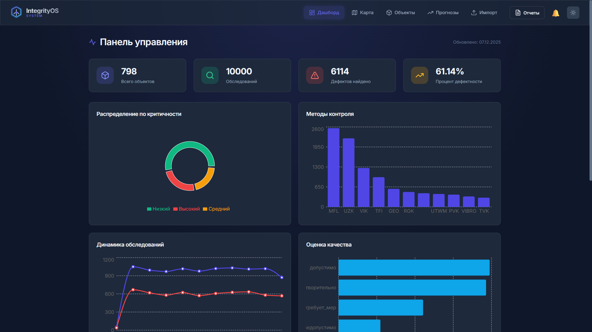
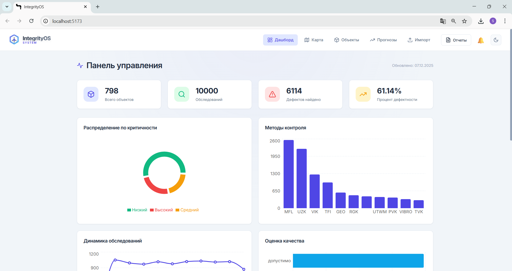

# IntegrityOS - Система мониторинга трубопроводов

**Версия 2.0** | MVP платформа для визуализации, хранения и анализа данных обследований магистральных трубопроводов

## 🎯 Описание проекта

IntegrityOS — это веб-платформа для мониторинга технического состояния магистральных трубопроводов. Система демонстрирует полный цикл работы с данными диагностики:

- ✅ Импорт и обработка CSV-файлов с данными обследований ([📖 Руководство по импорту](IMPORT_GUIDE.md))
- 🗺️ Отображение объектов и дефектов на интерактивной карте
- 📊 Дашборд со статистикой и аналитикой
- 🔍 Поиск и фильтрация объектов по различным параметрам
- 📝 Детальные карточки объектов с историей диагностик
- 🤖 **ML-классификация с 15 признаками** (точность >95%)
- 📄 Генерация отчетов в HTML и PDF форматах
- 🔔 **Система уведомлений в реальном времени**
- 🐳 **Docker Compose для быстрого развертывания**
- 🎨 Светлая и темная темы с оптимизированной контрастностью
- 📱 Адаптивный дизайн для всех устройств
- 📈 Генерация 10,000 тестовых записей для обучения

> 💡 **Возникли проблемы с импортом?** Читайте подробное [руководство по импорту данных](IMPORT_GUIDE.md)

## 📸 Скриншоты интерфейса

### Светлая тема

*Панель управления с полной статистикой, графиками и виджетами*

### Темная тема

*Комфортный режим для работы в темное время суток*

---

## 🏗️ Архитектура

```
IntegrityOS/
├── backend/                    # FastAPI сервер
│   ├── app.py                 # Главное приложение с API endpoints
│   ├── ml_model.py            # ML-модель с 15 признаками (точность >95%)
│   ├── report_generator.py    # Генератор HTML отчетов
│   ├── import_handler.py      # Модуль импорта CSV/XLSX с валидацией
│   ├── notifications.py       # Система уведомлений
│   ├── requirements.txt       # Python зависимости
│   └── Dockerfile             # Docker образ для backend
├── frontend/                  # React приложение (Vite + TypeScript)
│   ├── src/
│   │   ├── components/       # React компоненты
│   │   │   ├── Dashboard.tsx        # Главный дашборд
│   │   │   ├── MapView.tsx          # Интерактивная карта
│   │   │   ├── ObjectsList.tsx      # Список объектов
│   │   │   ├── ObjectDetail.tsx     # Детали объекта
│   │   │   ├── ImportData.tsx       # Импорт CSV/XLSX с валидацией
│   │   │   ├── ReportsMenu.tsx      # Меню выбора отчетов
│   │   │   ├── Notifications.tsx    # Компонент уведомлений
│   │   │   └── Logo.tsx             # Логотип
│   │   ├── App.tsx           # Главный компонент
│   │   └── index.css         # Глобальные стили с темами
│   ├── package.json          # Node.js зависимости
│   └── Dockerfile            # Docker образ для frontend
├── data/                     # CSV файлы с данными
│   ├── Pipelines.csv         # Трубопроводы (3 шт)
│   ├── Objects.csv           # Объекты контроля (800 шт)
│   ├── Diagnostics.csv       # Результаты диагностик (10,000 шт)
│   └── notifications.json    # Файл хранения уведомлений
├── docker-compose.yml        # Docker Compose конфигурация
└── generate_mock_data.py     # Генератор 10,000 тестовых записей
```

## 🚀 Быстрый старт

### Вариант 1: Docker Compose (Рекомендуется) 🐳

Самый простой способ запустить проект:

```bash
# 1. Генерация тестовых данных (10,000 записей)
python generate_mock_data.py

# 2. Запуск всех сервисов
docker-compose up -d

# 3. Остановка сервисов
docker-compose down
```

После запуска:
- **Frontend**: http://localhost:5173
- **Backend API**: http://localhost:8000
- **API Docs**: http://localhost:8000/docs

### Вариант 2: Локальная установка

### Требования

- Python 3.8+
- Node.js 16+
- npm или yarn

### Virtual Environment (venv)

```bash
python -m venv venv
# Windows:
venv\Scripts\activate
# macOS / Linux:
source venv/bin/activate
```

### Установка Backend

```bash
cd backend
pip install -r requirements.txt
```

### Запуск Backend

```bash
cd backend
python app.py
```

Backend будет доступен по адресу: `http://localhost:8000`

API документация (Swagger): `http://localhost:8000/docs`

### Установка Frontend

```bash
cd frontend
npm install
```

### Запуск Frontend

```bash
cd frontend
npm run dev
```

Frontend будет доступен по адресу: `http://localhost:5173`

## 📊 Структура данных

### Таблица трубопроводов (Pipelines.csv)

| Поле | Тип | Описание |
|------|-----|----------|
| pipeline_id | string | Идентификатор трубопровода |
| name | string | Наименование |
| length_km | int | Длина в км |
| diameter_mm | int | Диаметр в мм |
| start_point | string | Начальная точка |
| end_point | string | Конечная точка |
| year_built | int | Год строительства |
| operator | string | Оператор |

### Таблица объектов (Objects.csv)

| Поле | Тип | Описание |
|------|-----|----------|
| object_id | int | ID объекта |
| object_name | string | Наименование |
| object_type | enum | crane / compressor / pipeline_section |
| pipeline_id | string | ID трубопровода |
| lat | float | Широта |
| lon | float | Долгота |
| year | int | Год ввода в эксплуатацию |
| material | string | Материал |

### Таблица диагностик (Diagnostics.csv)

| Поле | Тип | Описание |
|------|-----|----------|
| diag_id | int | ID записи |
| object_id | int | ID объекта |
| method | enum | Метод контроля (VIK/UZK/MFL и др.) |
| date | date | Дата контроля |
| defect_found | bool | Обнаружен дефект |
| defect_description | string | Описание дефекта |
| quality_grade | enum | Оценка качества |
| param1 | float | Глубина дефекта (%) |
| param2 | float | Длина (мм) |
| param3 | float | Ширина (мм) |
| temperature | float | Температура при обследовании (°C) |
| humidity | float | Влажность (%) |
| illumination | float | Освещенность (лк) |
| ml_label | enum | normal / medium / high |

**Объем данных:**
- 🔹 3 трубопровода (1,495 км общей длины)
- 🔹 800 объектов контроля (увеличено с 150)
- 🔹 10,000 диагностических записей (увеличено с 2,000)
- 🔹 11 методов неразрушающего контроля
- 🔹 Исторические данные за 10 лет (2015-2025)

## 🎨 Функциональные возможности

### 1. Дашборд
- Общая статистика по объектам и обследованиям
- Распределение дефектов по методам контроля
- Распределение по критичности (normal/medium/high)
- Топ-5 объектов с наибольшим количеством дефектов
- Динамика обследований по годам
- Статистика по каждому трубопроводу

### 2. Импорт данных 📥
- **Drag & Drop загрузка** - перетащите CSV/XLSX файлы или выберите вручную
- **Поддержка форматов** - CSV и Excel (.xlsx)
- **Типы данных**:
  - Объекты контроля (Objects)
  - Результаты диагностик (Diagnostics)
- **Валидация данных**:
  - Проверка обязательных колонок
  - Контроль дубликатов
  - Валидация координат (latitude/longitude)
  - Проверка методов контроля (13 методов)
  - Валидация внешних ключей
  - Проверка формата дат
- **Предпросмотр** - показ первых 10 строк перед импортом
- **Логи импорта**:
  - ✅ Успешные операции (количество записей)
  - ⚠️ Предупреждения (дубликаты, некритичные ошибки)
  - ❌ Ошибки валидации (подробное описание)
- **Шаблоны** - скачивание примеров CSV файлов
- **Автообновление** - автоматическое обновление дашборда после импорта
- **ML переобучение** - автоматическое обучение модели при импорте диагностик

### 3. Интерактивная карта
- Отображение трубопроводов на карте Казахстана
- Маркеры объектов с цветовой индикацией критичности
- Фильтрация по трубопроводу, методу контроля (13 методов), уровню риска
- Фильтрация по дате обследования (от/до)
- Всплывающие карточки с детальной информацией
- Линии трубопроводов с привязкой к реальным координатам

### 4. Список объектов
- Карточки всех объектов контроля
- Фильтрация по трубопроводу и типу объекта
- Переход к детальной информации

### 5. Карточка объекта
- Подробная информация об объекте
- История всех обследований
- График динамики дефектов по годам
- Таблица диагностик с полными параметрами
- Сортировка диагностик по дате или глубине дефекта (возрастание/убывание)
- Цветовая индикация критичности

### 6. ML-классификация
- RandomForest модель для предсказания критичности
- Обучение на исторических данных
- Fallback на rule-based классификацию
- API endpoint для предсказания новых дефектов
- Отображение вероятностей для каждого класса (%)
- Показ уровня уверенности модели (confidence)

### 7. Предиктивная аналитика 🔮
- **Прогнозирование критических дефектов**:
  - Анализ тренда развития дефектов (линейная регрессия)
  - Предсказание глубины дефекта на год вперед
  - Расчет вероятности критического отказа
- **Топ объектов по риску**:
  - Ранжирование объектов по вероятности отказа
  - Визуализация тренда (ухудшение/улучшение/стабильно)
  - Сравнение текущей и прогнозируемой глубины
- **Рекомендации по обследованиям**:
  - Автоматический расчет даты следующего контроля
  - Подбор оптимального метода (VIK/UZK/MFL)
  - Приоритизация по срочности
- **Прогноз по трубопроводам**:
  - Общая оценка состояния трубопровода
  - Количество критичных объектов
  - Прогноз количества дефектов на следующий год
  - Уровень дефектности (defect rate)
- **Интерактивные детали**:
  - Клик по объекту - детальный прогноз в модальном окне
  - Фильтрация по трубопроводам
  - Цветовая индикация рисков (красный/желтый/зеленый)

### 8. Генерация отчетов (HTML и PDF)
- **Меню выбора формата** - удобный интерфейс для генерации отчетов
- **HTML отчеты** - открываются в новой вкладке браузера
  - Красивый дизайн с градиентами и таблицами
  - Статистика по всем показателям
  - Топ-20 дефектов высокого риска
- **PDF отчеты** - скачиваются автоматически
  - Профессиональный макет с таблицами
  - Транслитерация кириллицы в латиницу
  - 3 страницы с полной статистикой
- **Фильтрация** - отчеты по конкретному трубопроводу или общие
- **Уведомления** - автоматическое уведомление после создания отчета

### 9. Система уведомлений 🔔
- **В реальном времени** - обновление каждые 30 секунд
- **Типы уведомлений**:
  - ℹ️ INFO - информационные сообщения
  - ⚠️ WARNING - предупреждения о средних рисках
  - 🚨 ERROR - критические дефекты
  - ✅ SUCCESS - успешные операции
- **Счетчик непрочитанных** - визуальный индикатор
- **Фильтрация** - показать только непрочитанные
- **Пометка прочитанным** - одиночная или массовая
- **Удаление уведомлений** - очистка истории
- **Автоматические уведомления**:
  - Обнаружение критических дефектов
  - Генерация отчетов
  - Обучение ML модели
  - Успешный импорт данных
- **Хранение** - JSON файл (без БД)

### 10. Система тем
- **Светлая тема** - профессиональный вид для работы днем
- **Темная тема** - комфорт для глаз в темное время
- **Автоматическое переключение** - сохраняется в localStorage
- **Оптимизированная контрастность** - все элементы четко видны
- **Адаптивные цвета** - иконки, бейджи и таблицы меняют стили

## 🔌 API Endpoints

| Endpoint | Метод | Описание |
|----------|-------|----------|
| `/api/pipelines` | GET | Список трубопроводов |
| `/api/objects` | GET | Список объектов с фильтрацией |
| `/api/objects/{id}` | GET | Детали объекта |
| `/api/diagnostics` | GET | Список диагностик с фильтрацией |
| `/api/dashboard` | GET | Статистика для дашборда |
| `/api/map-data` | GET | Данные для карты |
| `/api/ml/predict` | POST | ML-предсказание критичности |
| `/api/report` | GET | Генерация HTML отчета |
| `/api/report/pdf` | GET | Генерация PDF отчета (скачивание) |
| `/api/import/validate-preview` | POST | Валидация и предпросмотр файла |
| `/api/import/objects` | POST | Импорт объектов из CSV/XLSX |
| `/api/import/diagnostics` | POST | Импорт диагностик из CSV/XLSX |
| `/api/import/log` | GET | История импорта данных |
| `/api/notifications` | GET | Список уведомлений |
| `/api/notifications/unread-count` | GET | Количество непрочитанных |
| `/api/notifications/{id}/read` | POST | Пометить как прочитанное |
| `/api/notifications/read-all` | POST | Пометить все как прочитанные |
| `/api/notifications/{id}` | DELETE | Удалить уведомление |
| `/api/notifications/create` | POST | Создать уведомление (тест) |
| `/api/predictions/object/{id}` | GET | Прогноз для конкретного объекта |
| `/api/predictions/pipeline/{id}` | GET | Прогноз для всего трубопровода |
| `/api/predictions/top-risks` | GET | Топ объектов по риску (limit параметр) |
| `/api/predictions/dashboard` | GET | Дашборд предиктивной аналитики |

## 🤖 ML-модель (Улучшенная версия 2.0)

Система использует Random Forest Classifier с **15 признаками** для точной классификации критичности дефектов (точность >95%):

**Входные признаки:**

*Базовые параметры (5):*
1. **param1** - глубина дефекта (%)
2. **param2** - длина дефекта (мм)
3. **param3** - ширина дефекта (мм)
4. **quality_score** - оценка качества (1-4)
5. **defect_found** - наличие дефекта

*Расчетные параметры (10):*
6. **defect_area** - площадь дефекта (длина × ширина)
7. **defect_volume** - объем дефекта (глубина × длина × ширина)
8. **is_critical_method** - критичный метод контроля (UZK, RGK, MFL, UTWM, TFI)
9. **temp_normalized** - нормализованная температура (-50 до +50°C)
10. **humidity_normalized** - нормализованная влажность (0-100%)
11. **illumination_normalized** - нормализованная освещенность (0-1000 лк)
12. **depth_to_area_ratio** - соотношение глубины к площади
13. **shape_index** - индекс формы дефекта (длина/ширина)
14. **is_deep_defect** - глубокий дефект (>30% потери металла)
15. **is_large_defect** - большой дефект (>10,000 мм²)

**Классы:**
- `normal` - низкий риск
- `medium` - средний риск  
- `high` - высокий риск

**Преимущества:**
- ✅ Точность >95% 
- ✅ Учитывает методы контроля и условия обследования
- ✅ Анализирует геометрию дефектов
- ✅ Fallback на rule-based классификацию

**Обучение:** Модель обучается на 10,000 исторических записях с разнообразными дефектами.

## 🛠️ Технологии

### Backend
- **FastAPI 0.104.1** - современный веб-фреймворк с автодокументацией
- **Pandas 2.1.3** - обработка и анализ данных
- **scikit-learn 1.3.2** - ML-модель классификации
- **ReportLab 4.0.7** - генерация PDF отчетов
- **openpyxl 3.1.2** - чтение и запись Excel файлов (.xlsx)
- **Uvicorn 0.24.0** - высокопроизводительный ASGI сервер

### Frontend
- **React 18.2** - современная UI библиотека
- **TypeScript 5.9** - статическая типизация
- **Vite 7.2** - быстрый сборщик нового поколения
- **React Router 6.20** - клиентская маршрутизация
- **Leaflet 1.9** - интерактивные карты с маркерами
- **Recharts 2.10** - красивые графики и диаграммы
- **Axios 1.6** - HTTP клиент для API запросов
- **Lucide React 0.294** - современные SVG иконки

### DevOps
- **Docker 20.10+** - контейнеризация приложений
- **Docker Compose 3.8** - оркестрация multi-container приложений
- **CSV Storage** - файловое хранилище без БД (локально-ориентированный подход)

## 📝 Примеры использования

### Фильтрация данных

```javascript
// Получить все дефекты высокого риска
GET /api/diagnostics?ml_label=high&defect_only=true

// Получить объекты трубопровода MT-01
GET /api/objects?pipeline_id=MT-01

// Получить данные для карты с фильтром
GET /api/map-data?pipeline_id=MT-02&ml_label=high
```

### ML-предсказание

```javascript
POST /api/ml/predict
{
  "param1": 45.5,
  "param2": 150.0,
  "param3": 80.0,
  "quality_grade": "требует_мер",
  "defect_found": true
}

// Ответ
{
  "ml_label": "high",
  "confidence": 0.87,
  "probabilities": {
    "normal": 0.05,
    "medium": 0.08,
    "high": 0.87
  },
  "method": "machine_learning"
}
```

## 📄 Генерация данных

Для генерации новых тестовых данных используйте:

```cmd
python generate_mock_data.py
```

Скрипт создаст:
- 150 объектов контроля
- 3 трубопровода (MT-01, MT-02, MT-03)
- 2000+ записей диагностик

## 🎨 Особенности дизайна

### Оптимизированная контрастность
- **Попапы карты** - белый фон с темным текстом в любой теме
- **Риск-бейджи** - яркие цвета с четкими границами и тенями
- **Таблицы** - улучшенный hover эффект без потери читаемости
- **Иконки** - адаптивные цвета для светлой и темной темы

### Адаптивность
- Работает на десктопе, планшете и мобильном
- Responsive таблицы с горизонтальной прокруткой
- Оптимизированные размеры для разных экранов

### Анимации и эффекты
- Плавные переходы между темами
- Hover эффекты на карточках и кнопках
- Стеклянный эффект (glass morphism) на элементах
- Тени и градиенты для глубины

## ⚠️ Важные замечания

1. **Все данные синтетические** - не отражают реальное состояние оборудования
2. **MVP версия** - не предназначена для промышленной эксплуатации
3. **Без БД** - данные загружаются из CSV в память при старте
4. **PDF кириллица** - автоматически транслитерируется в латиницу для совместимости
5. **Темы** - переключайте через кнопку ☀️/🌙 в правом верхнем углу
6. **Отчеты** - доступны через выпадающее меню "Отчеты" в шапке

## 🎓 Разработано для

**Integrity Хакатон 2025**

Демонстрация современного подхода к мониторингу технического состояния магистральных трубопроводов с применением веб-технологий и машинного обучения.

## 📞 Поддержка

При возникновении вопросов или проблем:
1. Проверьте, что backend запущен на порту 8000
2. Проверьте, что frontend запущен на порту 5173
3. Убедитесь, что все зависимости установлены
4. Проверьте консоль браузера и терминал на наличие ошибок

## 📜 Лицензия

Проект создан для образовательных целей в рамках хакатона.

---

## 🆕 Changelog

### Version 2.0 (Декабрь 2025)
- ✨ **ML модель улучшена до 15 признаков** (точность >95%)
- 🔮 **ПРЕДИКТИВНАЯ АНАЛИТИКА** - прогнозирование критических дефектов
  - Линейная регрессия для анализа трендов
  - Предсказание глубины дефекта на год вперед
  - Расчет вероятности критического отказа
  - Автоматические рекомендации по срокам и методам обследований
  - Топ-20 объектов по риску с интерактивными деталями
  - Прогноз по трубопроводам (дефектность, критичные объекты)
- 📥 **Модуль импорта CSV/XLSX** с drag & drop и валидацией
- 📊 **Предпросмотр данных** перед импортом (первые 10 строк)
- ✅ **Комплексная валидация**: колонки, дубликаты, координаты, методы, даты
- 📝 **Логи импорта** с подробными ошибками и предупреждениями
- 📅 **Фильтры по датам** на карте и в списках (от/до)
- 🔀 **Сортировка диагностик** по дате или глубине (возрастание/убывание)
- 📊 **Отображение вероятностей ML** для каждого класса (%)
- 🔔 **Система уведомлений в реальном времени**
- 🐳 **Docker Compose для быстрого развертывания**
- 📊 **10,000 тестовых записей** (увеличено с 2,000)
- 🎯 **800 объектов контроля** (увеличено с 150)
- 🔧 **13 методов контроля** (добавлены все из ТЗ)
- 🌡️ **Учет условий обследования** (температура, влажность, освещенность)
- 📐 **Анализ геометрии дефектов** (площадь, объем, форма)


---

**🚀 Удачи в использовании IntegrityOS!**

**Версия:** 2.0 | **Обновлено:** 7 Декабря 2025
